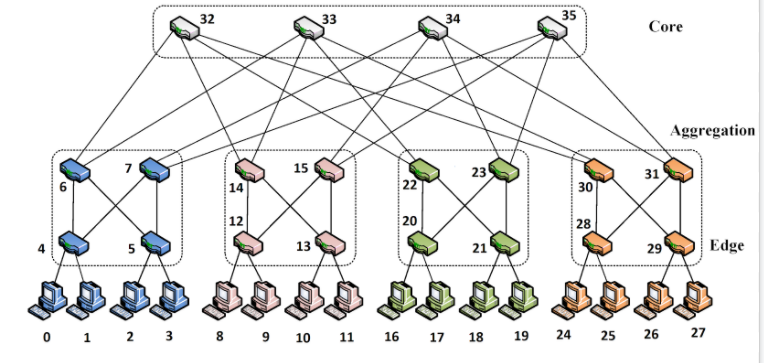
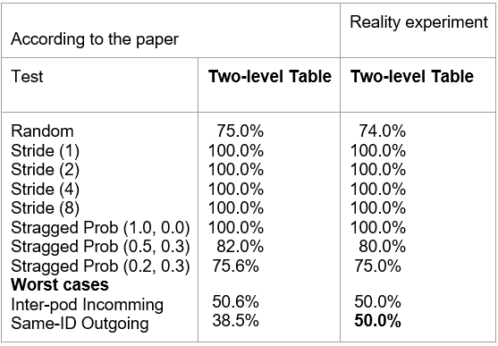

# RESI
A reduction simulation of data packet transmission in Data Center Network, using fat-tree topology 

## TABLE OF CONTENTS
- [DESCRIPTION](#description)
- [BACKGROUND](#background)
- [PROJECT'S ORGANIZATION](#project's-organization)
- [INSTRUCTIONS FOR USE](#instructions-for-use)
- [RESULTS](#results)
- [CONTRIBUTORS](#contributors)
- [LICENCE](#licence)

### DESCRIPTION

Today's data centers may contain tens of thousands of computers with high speed and large capacity. In order for these servers to function properly, people must set up the topology, routing algorithms, and flow control algorithms... One of the most popular topologies that have been used is **Fat-Tree**.

ReSi stands for Reduction Simulation:

* In this project, we simulate the process of data packet transmission in a data center network:
* In this simulator, we DO NOT take communication protocols such as HTTP, UDP, TCP ... into consideration.
* Resi's purpose: to allow developers to install (i) source and destination pairing; (ii) install routing algorithms; (iii) implement flow control algorithms.
* When running a simulation program (file ThrougphputExperiment.java), it will calculate the throughput value of the transmission process in a certain simulation period. 

Here is the example of a fat-tree topology (k = 4):

We generate the communicating pairs according to the following strategies, with the added restriction that any host receives traffic from exactly one host:
- Random: A host sends to any other host in the network with uniform probability.
- Stride(i): A host with index x will send to the host with index (x+1) mod 16.
- Staggered Prob: A host send to another host in its subnet with probability (Subnet P), and to its pod with probability (Pod P), and to anyone else with probability   (1 - Subnet P - Pod P).
- Inter-pod Incoming: Multiple pods send to different hosts in the same pod, and all happen to choose the same core switch.
- Same-ID Outgoing: Hosts in the same subnet send to different hosts elsewhere in the network such that the destination hosts have the same host IDs.

### BACKGROUND

Our project is inspired by the following two research papers:
* [A Reduction Model For Simulating Large-Scale Interconnection Network], Nguyen Tien Thanh, Nguyen Khanh Van, Bui Manh Cuong.

* [A scalable, commodity data center network architecture](http://ccr.sigcomm.org/online/files/p63-alfares.pdf), Mohammad Al-Fares, Alexander Loukissas, Amin Vahdat.
  - In this paper, the authors adopt a fat-tree topology to interconnect commodity Ethernet switches, with two-level routing table and some algorithms of flow control
  in order to improve the throughput of data center network.
  - They conduct experiments with a 4-port fat-tree, using 10 physical machines to set up this virtual network. On each machine, there is a Click to perform packet
  routing tasks.
  - Each host generates packet with speed 96 Mbps. The uplinks from the pod switches to the core switch are bandwidth-limited to 106,67 Mbps and all other links are limited to 96 Mbps.
  - They run five times on an experiemt and the simulation period is 1 minute.
 

### PROJECT'S ORGANIZATION
Here is the list of packages in our project:
  - common: provides data structures and addiontional classes for inputs and outputs (StdIn, StdOut..)
  - config: sets constant values
  - custom: creates a fat-tree graph, sets address for nodes and implements routing algorithm
  - event: generates events for the simulator and their own actions
  - infrastructure: provides essential infrastructures for this project
  - javatuples: provides a set of java classes that allow you to work with tuples
  - network: includes all the necessary elements to build a topology
  - routing: implements routing algorithm and fine routing path to build a routing table
  - simulator: generates the simulator and its actions
  - weightedloadexperiment: creates the communicating strategies to pair source hosts and destination hosts and calculates the throughput values

### INSTRUCTIONS FOR USE

1. This project is written in Java. Therefore, you can run it on IDEs such as Netbeans, Eclipse, IntelliJ IDEA, ...

2. In order to run this project, you have to install **Unmontreal SSJ Library**.
  - SSJ is a Java library for stochastic simulation. It provides facilities for generating uniform and nonuniform random variates, computing different measures related to probability distributions, performing goodness-of-fit tests, applying quasi-Monte Carlo methods, collecting statistics (elementary), and programming discrete-event simulations with both events and processes.
  - You can install SSJ either by **adding it as a dependency for your project**, by **downloading a binary release** or by **compiling it from scratch**.
  - SSJ is compatible with Java SE8 and later versions of Java. It requires the Java Development Kit (JDK), whose latest version is available at Oracle with installation instructions. It must be installed before installing SSJ.
  - It is also useful to install an integrated development environments (IDE) such as Eclipse, NetBeans, IntelliJ IDEA, for example, to write, compile, and run your Java code.
  - You can see [how to install SSJ here.](https://github.com/umontreal-simul/ssj) 

3. In order to run the project and calculate the throughput value, run the file ThrougphputExperiment.java

4. You can raise the simulation time from 1 second to 1 minute in class **config.Constant**, MAX_TIME = 60*((long)1e9)

5. You can also change one of the above communicating pairs (Random, Stride, Staggered Prob, Inter-pod Incoming, Same-ID Outgoing) in the main method of class [weightedloadexperiment.ThroughputExperiment.](https://github.com/vuminhhieu1311/Resi/blob/master/weightedloadexperiment/ThroughputExperiment.java)

6. Want to give a suggestion? Feel free: it's open source. you can [raise issues here.](https://github.com/vuminhhieu1311/Resi/issues)
The project is still very incomplete but under development. We would love to have your help in making our project better.

### RESULTS

Here are the results of the above described experiments:

Most of the results are coincident with the paper, making it possible to confirm that the experimental plan and the experimental tool (reduction simulation) are correct.
The only difference is in the "Same-ID outgoing" case.

### CONTRIBUTORS

- Vu Minh Hieu (hieu.vm183917@sis.hust.edu.vn)
- Nguyen Tien Thanh (nguyenthanh@soict.hust.edu.vn)
- Nguyen Khanh Van (vannk@soict.hust.edu.vn
- Le Vinh Nhon (nhon.lv176841@sis.hust.edu.vn)
- Nguyen Chi Hieu

### LICENCE

The javatuples is one of the simplest java libraries ever made, which is not our work. Its aim is to provide a set of java classes that allow you to work with tuples. All other code / scripts / materials are original contributions of the above contributors, and are released under the MIT LICENSE (see "./LICENSE"). 

We would appreciate you citing this code and the most relevant of our associated research publications below.

